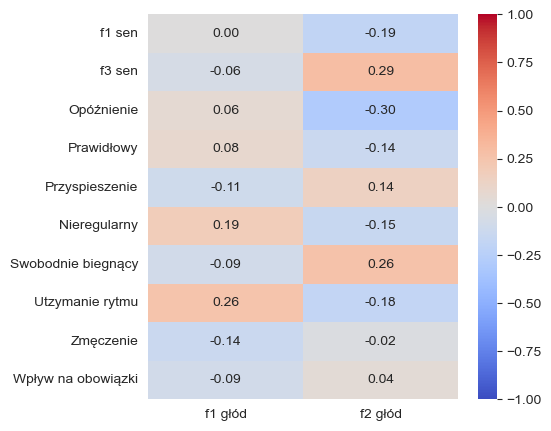

# Badanie powiązania snu i głodu
Na początku tego roku (2025) zaprojektowałem i przeprowadziłem badanie mające na celu sprawdzenie powiązania zaburzeń snu z odczuwaniem głodu.
Zebrałem odpowiedzi od 56 osób.
Sam musiałem zaprojektować kwestonariusz, oczyścić dane oraz przeprowdzić analizę.
# Wyniki
 - Wyniki nie zostały opublikowane, bo w końcu nie napisałem raportu z badania.
 - Wyniki analizy zostały uzyskane w skrypcie o nazwie analysis.ipynb
 - Wyszło, że faktycznie istnieje różnica pamiędzy odczuwaniem głodu związanym z sekrecją greliny u osoób z zaburzeniami snu oraz bez zaburzeń.
   

Należy patrzeć na różnicę w korelacji pomiędzy f1_sen oraz f3_sen oraz f2_głód (p-value tej różnicy: **0.013**).
Macież przedstawia także korelacje pomiędzy deklarowanym zaburzeniem snu oraz zbadanym poziomem greliny. Nie należy tak mocno sugerować się tymi wynikami, gdyż były to tylko deklaracje (należałoby skostruwać pytania, które rzetelnie badałyby poziom każdego z tych zaburzeń).
